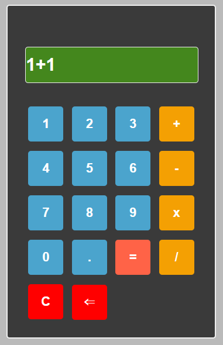

🧮 <b>Calculator App</b> 

A clean and modern Calculator App built using HTML, CSS, and JavaScript. 
This project performs basic arithmetic operations with a simple and user-friendly interface. 

🚀 <b>Live Demo</b> 

https://dea-kalkulator.netlify.app/ 

📸 <b>Preview</b> 

 

✨ <b>Features------</b> 

<ul>
  <li>➕ Addition</li>
  <li>➖ Subtraction</li>
  <li>✖️ Multiplication</li>
  <li>🧹 Clear button (C)</li>
  <li>⬅️ Delete last input</li>
  <li>⚡ Real-time calculation</li>
  <li>🎨 Modern UI design</li>
</ul>

🛠️ <b>Technologies Used-----------</b> 

Technology	Description : 
<ul>
  <li>HTML	Structure of the calculator</li>
  <li>CSS	Styling and layout</li>
  <li>JavaScript	Logic and functionality</li>
</ul>

🎯 <b>How to Use</b> 
Click the number buttons to input values 
Choose an operator (+, -, ×, ÷) 
Press = to see the result 

Use: 
C to clear all input 
← to delete last character 

📂 <b>Project Structure</b> 
calculator-app/ 
│── index.html 
│── style.css 
│── script.js 
│── screenshot.png 

💡 <b>Future Improvements------</b> 
<ul>
  <li>⌨️ Keyboard support</li>
  <li>🌙 Dark / Light mode toggle</li>
  <li>📱 Fully responsive design</li>
  <li>🧠 Advanced operations (%, √, etc.)</li>
</ul>

🙌 <b>Author</b> 
Created by Dea

Aspiring Frontend Developer 🚀 

⭐ <b>Support</b> 

If you like this project, don’t forget to star this repository ⭐